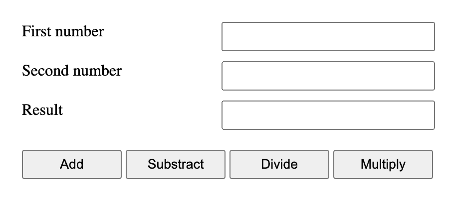

We know many operators from school. They are things like addition `+`, multiplication `*`, subtraction `-`, and so on.

In this chapter, we’ll start with simple operators, then concentrate on JavaScript-specific aspects, not covered by school arithmetic.

The following math operations are supported:

- Addition `+`,
- Subtraction `-`,
- Multiplication `*`,
- Division `/`,
- Remainder `%`,
- Exponentiation `**`.

The first four are straightforward, while `%` and `**` need a few words about them.

---

## Addition +

The “ADD” operator is represented with a plus sign :

```javascript
let a = 5,
  b = 3;
console.log(a + b); //8
```

The arithmetic operator can be used to combine two strings also.

```javascript
let s = "my" + "string";
console.log(s); // mystring
```

## Subtraction -

The Subtract operator is represented with minus sign:

```javascript
let a = 5;
let b = 3;
console.log(a - b); //2
```

## Multiplication \*

The Multiplication operator is represented with asterisk sign:

```javascript
let a = 5;
let b = 3;
console.log(a * b); //15
```

## Division /

The Division operator is represented with slash sign:

```javascript
let a = 10;
let b = 5;
console.log(a / b); //2
```

## Exponentiation \*\*

The exponentiation operator `a ** b` raises a to the power of b.

In school maths, we write that as a^b .

```javascript
console.log(2 ** 2); // 2² = 4
```

## Remainder %

The remainder operator `%`, despite its appearance, is not related to percents.

The result of `a % b` is the remainder of the integer division of a by b.

```javascript
console.log(5 % 2); // 1, a remainder of 5 divided by 2
```

---

## Complete the tasks below:



Create an HTML form for arithmetic calculations.
